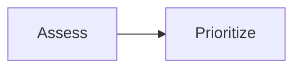

# markdown-it + Mermaid + LaTeX — Implementation Detail

Companion to [`AGENTS_POSSIBLE_DECISIONS__MARKDOWN.md`](AGENTS_POSSIBLE_DECISIONS__MARKDOWN.md).  
**Default stamp:** `decisions.markdown_renderer` → `markdown-it`.

Port patterns from [`context-devbrain/`](context-devbrain/) (read-only reference). Approximate line cues only — search the named symbols in those files.

---

## CDN / script tags (from DevBrain `index.php`)

DevBrain loads (versions as of that tree):

```html
<script src="https://cdn.jsdelivr.net/npm/mermaid@10.6.1/dist/mermaid.min.js"></script>
<script src="https://cdn.jsdelivr.net/npm/markdown-it@12.0.4/dist/markdown-it.min.js"></script>
<script src="https://unpkg.com/markdown-it-anchor@8.6.5/dist/markdownItAnchor.umd.js"></script>
<script src="assets/js/vendors/MarkdownItLatex.umd.js"></script>
<!-- KaTeX CSS/JS required by the LaTeX plugin (use CDN or vendor copy) -->
<!-- optional: markdown-it-emoji, highlight.js -->
```

For RN Simulation Game:

- Add markdown-it (+ anchor), Mermaid, and LaTeX/KaTeX next to existing shell CDNs in `game/index.html`.
- Prefer a maintained CDN pair (e.g. KaTeX + a markdown-it math plugin) or vendoring DevBrain’s `MarkdownItLatex.umd.js` if it matches the chosen markdown-it major.
- Remove or stop calling `marked` once Help uses the shared renderer (`game/index.html` currently loads marked for `docs.js`).

Initialize Mermaid once at app boot:

```js
if (window.mermaid) {
  window.mermaid.initialize({ startOnLoad: false, securityLevel: 'strict' });
}
```

---

## Core render pipeline (from `note-opener.js`)

Flow DevBrain uses after fetch:

```
fetch markdown text
  → strip YAML frontmatter (optional)
  → light preprocess (line breaks, ![[image.ext]], ==highlight==, ~~strike~~, > [!note] → <details>)
  → markdownit({ html, linkify, breaks }).use(markdownItAnchor).use(...optional)
  → html = md.render(source)
  → rewrite [[Wiki Title]] → internal <a>
  → root.innerHTML = html
  → enhance: highlight code, mermaid fences, linkPopover.rescan()
```

### markdown-it construction (port)

Near the middle of `context-devbrain/assets/js/note-opener.js`:

```js
var md = window.markdownit({
  html: true,
  linkify: true,
  breaks: false,
  typographer: false
}).use(window.MarkdownItLatex) // or equivalent markdown-it + KaTeX plugin
  .use(window.markdownItAnchor, {
  level: [1, 2, 3, 4, 5, 6],
  slugify: function (s) {
    s = s.replace(/\s+/g, '-').replace(/[^a-zA-Z0-9\-]/g, '');
    if (s?.length && !/[a-zA-Z]/.test(s[0])) {
      s = 'at' + s;
    }
    return s;
  },
  permalink: false // DevBrain uses share permalinks; help modal can omit or use in-page hashes
});
```

**RN game notes:**

- Prefer `permalink: false` inside Help modals; keep the **same `slugify`** so hover-preview TOC hashes match heading ids.
- **LaTeX math is in scope for E0.M5** — nursing dosage / drip-rate / unit-conversion equations in learning MD.
- Keep `html: true` only for first-party authored docs (same trust model as today).

### LaTeX / KaTeX authoring

Support at least:

- Inline: `$Dose = \frac{ordered}{available} \times volume$`
- Block: `$$mcg/kg/min = \frac{mcg/min}{kg}$$`

DevBrain also remaps `$…$` before render in places (see `yourTextTransformation` near LaTeX handling in `note-opener.js`) — port only if the chosen plugin needs that quirk; prefer a clean KaTeX-backed plugin that understands `$` / `$$` without brittle rewrites.

Include KaTeX stylesheet in the Help/learning host document so fractions and exponents render correctly.

### Soft line breaks (port)

DevBrain forces Markdown hard breaks by appending two spaces before single newlines (see `doubleNewLine` in `note-opener.js`). Port if authors expect Obsidian-like single-newline breaks; otherwise leave default CommonMark paragraphs.

### Wiki / internal links (port)

After `md.render`:

```js
function replaceBracketsWithLinks(htmlString, openNoteHref) {
  return htmlString.replace(/\[\[(.*?)\]\]/g, function (match, p1) {
    const encodedText = encodeURIComponent(p1);
    return `<a href="${openNoteHref(encodedText)}" class="md-internal-link" data-md-note="${encodedText}">${p1}</a>`;
  });
}
```

Also treat relative `*.md` hrefs produced by normal Markdown links as internal notes (same open + hover path).

`openNoteHref` in this game should resolve against the Help/learning catalog (path or title), **not** DevBrain’s `?open=` + `local-open.php` unless you deliberately mirror that URL scheme.

### Obsidian image paste (optional port)

```js
// ![[photo.png]] → 
text = text.replace(/!\[\[(?!http)([^\/\]]+\.(png|bmp|jpg|jpeg|gif))\]\]/gi, '');
```

---

## Live Mermaid

DevBrain uses Mermaid heavily in `mindmap.js` for list→diagram UX. For **authored MD**, render fenced blocks after insert:

```js
export async function enhanceMermaid(rootEl) {
  if (!window.mermaid) return;
  const nodes = rootEl.querySelectorAll('pre code.language-mermaid, pre.mermaid, .mermaid');
  nodes.forEach((node, i) => {
    const pre = node.closest('pre') || node;
    const source = node.textContent || '';
    const host = document.createElement('div');
    host.className = 'mermaid';
    host.id = `mermaid-${Date.now()}-${i}`;
    host.textContent = source;
    pre.replaceWith(host);
  });
  await window.mermaid.run({ nodes: rootEl.querySelectorAll('.mermaid') });
}
```

Authoring:

````markdown

````

Call `enhanceMermaid` from `enhanceMarkdownDom` after every successful Help/learning open. Re-run after dynamic replaces.

---

## Help menu integration

Today: `game/assets/js/docs.js` fetches `../docs/{category}/{file}` and `marked.parse` into a popup window.

Target:

1. Fetch unchanged (no new note API).
2. `html = renderMarkdown(text, { category, filename })`.
3. Show in existing modal system (`modal.js`) **or** keep popup, but always run `enhanceMarkdownDom` in that document/`#markdown-root`.
4. After paint: `linkPopover.rescan()` (see hover companion).

Register new learning files the same way as player docs: file on disk + entry in docs/learning structure config.

---

## Frontmatter

If notes include YAML:

```md
---
title: IV Push Safety
---
```

Strip with the same regex DevBrain uses before render:

```js
source = source.replace(/^---\r?\n[\s\S]*?\r?\n---\r?\n?/, '');
```

Do not require frontmatter for MVP.

---

## File map (E0.M5 implement)

| File | Action | Purpose |
|------|--------|---------|
| `game/index.html` | MODIFY | CDN: markdown-it, anchor, mermaid, KaTeX + math plugin; drop marked when unused |
| `game/assets/js/markdown-renderer.js` | CREATE | Shared render + enhance API (incl. `.use` math plugin) |
| `game/assets/js/docs.js` | MODIFY | Call shared renderer; optional modal host |
| `game/assets/css/` (markdown / mermaid) | CREATE or MODIFY | Prose + diagram sizing inside help chrome (+ KaTeX if not CDN-linked in host) |
| `docs/players/`, `docs/learning/` | AUTHOR | Content only |

Do **not** import DevBrain PHP (`local-open.php`, `cache_render.js`) into the game runtime.

---

## Acceptance checks

- [ ] Help / Docs opens an authored `.md` via markdown-it (not marked)
- [ ] A ` ```mermaid ` fence renders as a live diagram
- [ ] Inline `$…$` and/or block `$$…$$` math renders (dosage-style equation smoke test)
- [ ] `[[Other Note]]` becomes a clickable internal link that opens via the same catalog fetch
- [ ] Heading ids use the shared slugify (ready for hover TOC)
- [ ] `decisions.markdown_renderer` stamped `markdown-it`
