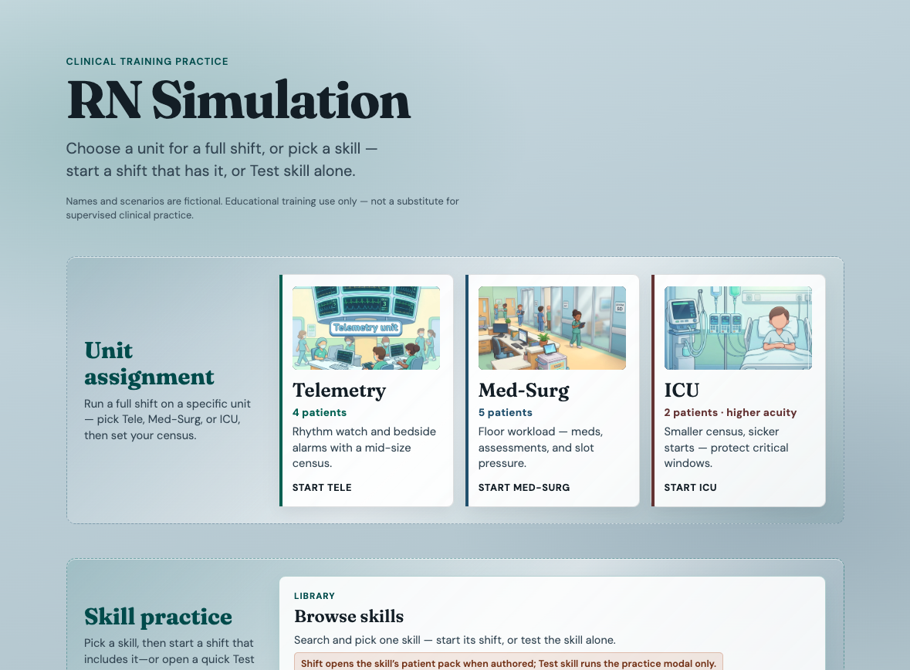

# RN Simulation Game

By Weng (Weng Fei Fung)


<a target="_blank" href="https://github.com/Siphon880gh" rel="nofollow"></a>
<a target="_blank" href="https://www.linkedin.com/in/weng-fung/" rel="nofollow"></a>
<a target="_blank" href="https://www.youtube.com/@WayneTeachesCode/" rel="nofollow"></a>

## Description

Experience the intensity of a fast-paced 12-hour shift in this nursing simulation game. Manage multiple patients in ICU, Tele, or Med-Surg units, facing real workloads and emergent situations. Your goal is to complete your shift without going into overtime, testing your clinical judgment, time management, and prioritization skills in a dynamic hospital environment.

Coming soon: Sub-acute and ER.

## Screenshot



## STATUS

Playable clinical-training MVP + Later backlog slices (challenges, chaos packs, alternate shifts). Optional auth/friends (**E8.M2**) stays off until explicitly re-approved.

## Run locally

Serve the repo root over HTTP — ES modules need a static server, not `file://`.

```bash
# from repo root
python3 -m http.server 8765
# open http://localhost:8765/  → choose Tele / Med-Surg / ICU
# (opening /game/ without ?scenario= redirects back to the picker)

# Optional: PHP for /placeholders/image.php|video.php (titled SVG placeholders)
# php -S localhost:8765 -t .
# Then set GameConfig.mediaPlaceholders.source = 'php' (default is client data-url)
```

Placeholder art inventory: [`PLACEHOLDER_ASSETS.md`](PLACEHOLDER_ASSETS.md).


## Choose your assignment (front page)

| Unit | Census | Start URL |
|------|--------|-----------|
| Telemetry | 4 patients | `http://localhost:8765/` → **Start Tele** |
| Med-Surg | 5 patients | `http://localhost:8765/` → **Start Med-Surg** |
| ICU | 2 patients (higher acuity) | `http://localhost:8765/` → **Start ICU** |

After picking a unit, choose: **Full load**, **No admission** (N−1, no admit), **Admission — start of shift**, or **Admission — middle of shift**. Admit options start at N−1 and bring the held patient with an admission checklist. Query: omit `census`, or `census=minus1` / `admitStart` / `admitMiddle`.

Packs: `game/events/scenarios/tele-4.json`, `medsurg-5.json`, `icu-2.json`.

## Demo presets (portfolio)

| Preset | URL (after local server is up) |
|--------|--------------------------------|
| Assignment picker | `http://localhost:8765/` |
| Quick night (~15 min wall) | `http://localhost:8765/game/index.html?speed-factor=48` |
| Quick day shift | `http://localhost:8765/game/index.html?speed-factor=48&scenario=events/scenarios/day-shift-medsurg.json` |
| Slower teaching pace | `http://localhost:8765/game/index.html?speed-factor=12` |

Legacy packs: `night-shift-default.json` (default six-patient), `day-shift-medsurg.json`. Chaos incidents merge from `events/incidents/chaos-night-medsurg.json`.

## Hospital Shifts

Optional query params:
- `?speed-factor=4&shift-starts=1700`
- `?scenario=events/scenarios/day-shift-medsurg.json`


## Tasks

For an element to be read as a task that is scheduled, the player can perfrom, and there's a deadline, there are three html attributes:
- `data-scheduled="2100"`
- `data-expire="+120"` or `data-expire="2300"` 
- `data-duration-mins="10"`

```
    <li data-scheduled="2100" data-expire="+120" data-duration-mins="10" class="bg-white p-4 rounded-lg shadow flex items-center">
        <i class="fas fa-pills text-blue-500 text-xl mr-3"></i>
        <span class="font-medium text-gray-900">Atorvastatin</span>
        <span class="ml-auto text-sm text-gray-500">2200</span>
    </li>
    <li data-scheduled="2100" data-expire="2300" data-duration-mins="10" class="bg-white p-4 rounded-lg shadow flex items-center">
        <i class="fas fa-pills text-blue-500 text-xl mr-3"></i>
        <span class="font-medium text-gray-900">Aspirin (Low-dose)</span>
        <span class="ml-auto text-sm text-gray-500">2200</span>
    </li>
```

Speed factors to how long your simulation session will be:
- 12 hours → speedFactor = 1
- 6 hours → speedFactor = 2
- 3 hours → speedFactor = 4
- 2 hours → speedFactor = 6
- 1 hour → speedFactor = 12
- 45 minutes → speedFactor = 16
- 30 minutes → speedFactor = 24
- 15 minutes → speedFactor = 48
- 10 minutes → speedFactor = 72
- 5 minutes → speedFactor = 144
- 3 minutes → speedFactor = 360


### Shipped vs later

**In the build:** multi-patient census, slots + queue, availability windows, scenario/incident packs, med identity + bed-prep + Code Blue challenges, thin→richer deterioration, scoring/debrief, military shift clock with speed factor.

**Still later / optional:** authored Midjourney unit stills, full acuity physiology, auth/friends (E8.M2 — re-approve only).

### Learning Objectives:

- Develop clinical prioritization skills
- Practice safe medication administration
- Improve time management in high-pressure situations
- Learn to delegate appropriately
- Master documentation requirements
- Handle emergencies while maintaining care for other assigned patients

Perfect for nursing students and new graduates to practice clinical decision-making in a risk-free environment. Challenge yourself with increasing difficulty levels as you gain experience managing complex patient assignments.
