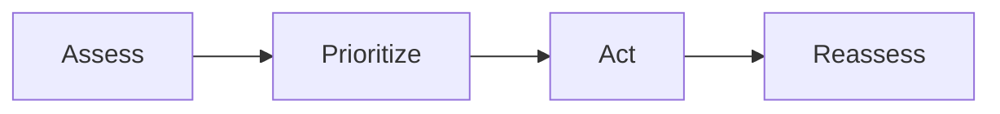

# Prioritization basics

A short learning note for Help/Docs smoke tests. See also [[About]].

## Shift pressure

Under an accelerated clock, complete the most time-sensitive work first.

Dose equation inline: $Dose = \frac{ordered}{available} \times volume$

$$mcg/kg/min = \frac{mcg/min}{kg}$$

## Flow

## Related

- Player About: [[About]]
- Relative link: [About file](../players/ABOUT.md)
